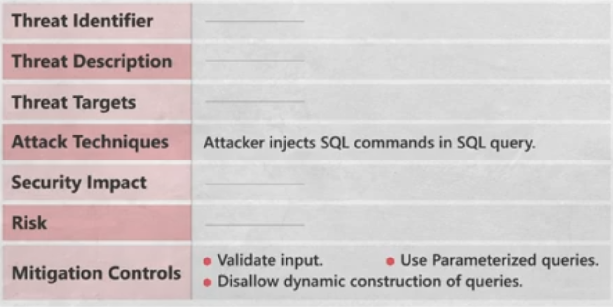

## SDLC

1. Requirements :
	Stakeholders (Business Man) put the Line and Idea of his Application (Requirements)
	Examples:
	- APP displays products.
	- Customers order products.
	- Orders go to warehouse.
	- Delivery phase.
	- Orders delivered to end users.
	  any software need well documented requirements to decrease time line and Cost and  Increase Quality 
	### **Classification**
	- Functional Requirements:
		the features or functions that needed by the use in the application
	- Non -Functional Requirements:(Time and Cost Increase)  so is postponed in many businesses
		- Security 
		- User Expectations from the Application
		- Scalability
		
2. Design :
	Designers Design the structure of Every Part of the application which will match the Requirements (Software Engineering) 
	- ...etc
	Steps of Design
	1. Transform all Req into Detailed specification 	- Panels and Portals for Admins
		- Users Relations
		- Panels and Portals for Admins
		- End User Portals
		- APIs and Data Base Communications
	2. Create app workflow 
		- Workflow design is **the process of outlining all the tasks and processes in a visual format like flow diagrams or flowcharts**. All the team members and stakeholders get a high-level overview of each task in the process with the help of an accurate workflow design.
		  
	3. create app wireframes 
		- Pages like menus and profile page  
		- Buttons
		- colors
		- Input Data fields
3. Development
	1. Turns Designed App to WebApp and Mobile app By Coordinating from Mobile Development team and Backend Team and Front end Team
4. Testing
	Quality Control  Testing (QCT) Team  make sure that the Developed software matched the business requirements with same way in the designed workflow and emulate all users behaviors' and ensure the code is without coding or logic errors 
5. Deployment
	Developers or DevOps  Team 
	- Deploy the WebApps,DBs and APIs on Server or Cloud and Use the cost and load revenant resources  
	- hosting and domain registration
	- prepare the app and upload it to the store 
Within **Waterfall** every team should end its assigned process till the next team begin the next  process
within **Agile** we separate the Requirements and make full cycle for each requirement  so we make separated cycles (sprints) take from 1 -3 weeks then merging  all the output together

## Security
### CIA (Core Security pillars)
1. Confidentiality: Leak of Sensitive Data or Information to Unauthorized Actor
2. Integrity : Unsecure Change of Sensitive Data or Information by Unauthorized Actor
3. Availability : Unsecure Disavailing of Sensitive Data or Information by Unauthorized Actor
### AAA
1. Authorization Sensitive Data showing and Functions Executions by Authorized Users int their specific scope
   - that principle made using **Permissions** **Privileges**
   - Violation of it is **Broken Access Control**
2. Authentication
	Way of Ensuring the User Identification by **Authentication Factors**
	- Something You Know : Passwords
	- Some Thing You Have : Authentication Devices ,Keys ,Phone Numbers (OTPs) or RFID Cards 
	- Some Thing You Are : Biometric Authentication methods (FACEID, Fingerprint, Eyes)
3. Accountability
	Way of record all users activities Make sure that every  User is responsible for its activity
	- Auditing
	- Logging and monitoring
	IBM Report says the average breach requires nearly 300days to Identify and Contain

### Definitions
- Assets :Every thing need protection like : `Data` ,Employee Devices , Codes, Data Centers , Network and Servers
- Vulnerability: weakness on the security mechanisms on any asset not exploited 
- Threat: Trail of  Exploiting Vulnerability

### Security Standards
Some methods guidelines and reference frameworks increase security efficiency for our System

- CSRC (Cyber Security Regulation and Compliances)
	 - PCIDSS : followed by any Enterprise using Bank Cards or event store its  information (Card Holder Data) to be used in payments like : banks, Payment Getaways
	- ISO 27000
	- HIPAA : to ensure that the PHI is secured by the corporate store it
### Security Design
- Asset Classification
	- Public
	- Private
	- Restricted
- Understanding threat actors
	- Script Kiedis
	- External Users
	- Internal Employees
	- APT Groups and cyber criminals
- Building Security Controls follows CIA

#### Vulnerability Classification 
CVSS Calculator
- `Attack Vector`
	1. Network : Public Disclosed Data have the weakness 
	2. Adjacent: Require Tunnel or VPN to access the Data have the weakness  
	3. Local : Require Access to the Local Network of the Enterprise by get into it to access the Data have the weakness   
	4. Physical :Require Device Direct access for User ,employee , Server or Data Center to access the Data have the weakness
- `Privilege Required`
	1. None : Not Authenticated user
	2. Low :  Authenticated User
	3. High : High Privileged User
- `Scopes`
	1. Changed : affects more than 1 Component 
	2. Unchanged : affects only its Component
- `CIA`
#### Data Classification
- Types
	 - Structured data
		- Data Bases ,Excel Sheets 
	 - unstructured data
		-  Multi-Media Files Mails and Documents 
- Labels 
	That Classification can be based on `CIA`, or `NIST SP 800-18`
	The Target is to Decrease Data Protection Cost
	- Public
	- Sensitive
	- Confidential
	Business Owners
	- Review Data classification
	- ensure that security controls is applied based on data classification
	- Put authorization list and access criteria based on data classification
	- Ensure that Backup and recovery Mechanisms appropriate to be implemented
	Data Custodian
	- Some Responsibilities like Backup and recovery duties and access approval authority is delegated to him by business owner
	- Make Information Classification Exercise
##### 1. Confidentiality Classification

| Level          | Is Disclosed by Restricted Roles? | Is Disclosed by Roles? | Is Publicly Disclosed? |
| -------------- | --------------------------------- | ---------------------- | ---------------------- |
| `Restricted`   | **Yes**                           | No                     | No                     |
| `Confidential` | No                                | **Yes**                | No                     |
| `Public`       | No                                | No                     | **Yes**                |

##### 2. Integrity Classification

| Damage Level | Critical damage on alteration | Significant damage on alteration | Minimal/no damage on alteration |
| ------------ | ----------------------------- | -------------------------------- | ------------------------------- |
| `High`       | **Yes**                       | No                               | No                              |
| `Medium`     | No                            | **Yes**                          | No                              |
| `Low`        | No                            | No                               | **Yes**                         |

##### 3. Availability Classification

| Damage Level | Critical damage on alteration | Significant damage on alteration | Minimal/no damage on alteration |
| ------------ | ----------------------------- | -------------------------------- | ------------------------------- |
| `Critical`   | **Yes**                       | No                               | No                              |
| `Essential`  | No                            | **Yes**                          | No                              |
| `Suppourt`   | No                            | No                               | **Yes**                         |

### Software Quality Attributes
- Reliability
	The Software Functions as it it expectedto
- Resiliency
	- Software Doesn't Violate Security policies 
	- Software is able to withstand attacks
- Recoverability
	Software Can Recover from damage caused by threats and attacks

Software without security will be attacked and Organization will fail

## Secure SDLC (SSDLC)

Before the SSDLC Software used to be security tested after just before the Production 
and that costs very much money effort and time for example 
(there is a security issue in the requirement phase which means  there are 4 teams worked on it with their salary for around 2weeks and we will reimplement it what if us caught it from its phase  ) (Forget Pass Questions Design)
that is **SSDLC**
**SSDLC** (Secure Development Life Cycle) means that we integrate security with all SDLC Phases int that Steps
## Secure SDLC
### SSDLC Frameworks
#### NIST -> SP 800-64 => Full Documentation of SSDLC (archived on 2019)
#### NIST -> SP 800-160 => Full Documentation of SSDLC
#### BSIMM Building Security in Maturity Model ->
Framework 
- helps organization on plan ,Implementation and progress for Software Security Operations
- helps Decision makers to determine `the relevant and Efficient security priority chain for their budget , resources and time frame ` based on the result of  ratings from data analysis (Data Driven Evolution) and the targeted Objectives
- Sections
	- Governance
	- Intelligence
	- SSDLC Touch Points
	- Deployment
### SSDLC
#### 1. Security Requirements with **Risk Assessment**:	
 - Risk: Probability of making threat
- We Can Classify Risk level between Low , Medium, High , Critical Based on
		- Importance of asset
		- Strength of threat
		- The Degree of the Vulnerability
- Risk Categories 
		- Fraud : Internal or External threats
		- Stealing Stealing Sensitive Information
		- Breach of Privacy Stealing Private Information
		- Damage: Acts of Destructing of Sensitive data (Ransomware)
		- Denial of Service: Compromising the Availability of Company services
		  
##### **Sources for Security Requirements** 
- Internal sources
	- Organizational Sources
		- Policies
		- Standards
		- Patterns
	- End-User Business Functionality
	- Business Owners Like : Acceptable risk threshold
- External Sources
	- Regulations
	- Compliance Initiatives
	- Geographical Requirements

##### **Types of Requirements**
- CIA
	 - CIA
		1. Confidentiality: Leak of Sensitive Data or Information to Unauthorized Actor
			- Data In Transit 
				- Data Is transmitted over Unprotected Network
			- Data In Processing 
				- Data Is In Memory of Device
			- Data In Storage
				- Data at rest which means is physically stored in data bases archive files and documents Using Storage Units On Prem or On Cloud
			- Controls
				1. Secret Writing 
					1. Overs : Data Is Available but isn't understandable
						- Encryption **for sensitive Data**
						- Hashing **for passwords**
					2. Covert
						- Steganograghy
						- Digital Watermarking
							- Visible: Mails Signature 
							- Invisible : Identify Originator(UserID)
							- Preventing Unauthorized Coping (Copyright)
				2. masking : Turns data to asterisk (Pas***)
		2. Integrity : Unsecure Change of Sensitive Data or Information by Unauthorized Actor
		   - Security Controls of Data Accuracy :  Ensure that is no Unauthorized modification made to data
		   - Reliability
		   - Examples
		     - Software that is published should provide the recipient with a computed checksum and the hash function used to compute the checksum
			- All systems and batch processes need to be identified, monitored and prevented from altering data, unless explicitly authorized to.
			- All input forms and Query String inputs need to be validated against a set of allowable inputs BEFORE the software accepts it for processing.
		3. Availability : Unsecure Disavailing of Sensitive Data or Information by Unauthorized Actor
		  - SLA (Service Level Agreement)
			  - RPO :Recovery Point Objective: Maximum Amount of data can be lost.
			  - MTD :Maximum Tolerable Down Time: Total amount of time that a system can be disrupted
				   - RTO :Recovery Time Objective :Tolerable Amount of Down Time
				     You Should Determine 
				     How and  will the Software Functionalities Resume Critical and Essential and How Long Will take to recover afterdown time based on their classification	
			- Measurement 
				- Nines (Software Availability should be Higher than 5 nines)
					![[five-nines1.avif]]
				- Load
					Load Of Concurrent Session
					N of Users per Point of Time
					Fixed By Replicating Data Across Data Center and Load Balancer to Decrease the Time of Data Transfer and Handel DOS Trails
	- AAA
		1. Authentication
			Way of Ensuring the User Identification by **Authentication Factors**
			- Something You Know : Passwords
			- Some Thing You Have : Authentication Devices ,Keys ,Phone Numbers (OTPs) or RFID Cards 
			- Some Thing You Are : Biometric Authentication methods (FACEID, Fingerprint, Eyes)
			- Types
				1. Anonymous Authentication
				2. Basic Authentication (HTTP 1.0) Transferred with B64 Encode
				3. Digest Authentication : Passwords stored in Hash 
				4. Integrated Authentication : Active Directory 
				5. Client Certificate Authentication : SSH
				6. Forms Authentication
				7. Token Authentication
				8. Physical Authentication: RFID Cards 
				9. Biometric Authentication : Fingerprint
				10. Multi Factor Authentication
				11. Single Sign On
		  2. Authorization Sensitive Data showing and Functions Executions by Authorized Users int their specific scope
			   - that principle made using **Permissions** **Privileges**
			   - Violation of it is **Broken Access Control**
			   - Subjects , Objects Actions Diagram
				   - Subject: User or Process need to Perform Actions (LIKE : CRUD) on  Data and Resources
			- Types
				- RBAC (Role Based Access Control):
					  Least Privileges
					1. Make Roles Model (Privileges) On the Application
					2. Determine Permissions for Every role on the Resources that delegate to any user within this role(Like : Admin ,User or Customer, Trader )
				- RBAC(Resource Based Access Control)
					- Used In Distributed and Multi tired Architectures
					- Types:
						- Impersonation and Delegation Model (Like :Used in Active Directory Components)
						- Trusted Subsystem model
				- MAC(Mandatory Based Access Control)
				- DAC (Discretionary Based Access Control)
				- NDAC(Non Discretionary Based Access Control)
			- Examples :
				- Restrict access to sensitive data for high level users
				- Unique Tokens Should be generated for Users once they authenticated on the system to avoid them from reauthenticate when performing authorized action
				- Determine Simple Roles Model and determine their permissions
				  1. Guest Uses Unauthenticated :Browse Only
				  2. General Users authenticated: Buy Rate and comment 
				  3. Administrator Users: Create , Edit and Delete   

		3. Accountability
			Way of record all users activities Make sure that every  User is responsible for its activity
			IBM Report says the average breach requires nearly 300days to Identify and Contain
			- Auditing : 
				- Help Us Determine the Unusual and Abnormal User Behavior that could be sign of 
					- Error or Bad User Experience avoiding by troubleshooting these errors (OTLOB Coupon not used)
					- compromising with Integration of Forensics and Investigation we can get all the attack path and affected assets
			- Logging and monitoring
				Records Contain
				1. Subject : User or Process Details or ID refer to Details in DB
				2. Action : Performed Operation 				
				    Business Transaction (Payments , Price Edit) 
				     Administrative Function Executions
				3. Object: affected resource
				4. Timestamp: Timestamp Format `MMM dd yyyy HH:mm:ss`
				 Log the Application errors in Detailed Way
				 Audit and Logging Files Should Be  Never Overwritten
				 Audit Logs must be securely retained for a specific time and the dissection in that and all the logging process mainly taken by business owners
			- Examples:
				- Failed Login (User , IP , Timestamp)
				- Price modification (User ID , Product ID , Original Price , Timestamp)
- General
	- Session Management
		Upon User Authentication  we should Identify User By Generated SessionID or Token within specific timeframe token will be invalid and will require reauthentication and generate new token
		- Examples
			- Each User Should Only Have one active session at a time so the users' activity can be uniquely tracked
			- The User should not be required to provide user credential once authenticated
			- session expiration time or condition
			- Session ID must be Encrypted and Not Predictable
	- Error & Exception Handling
		- Information Discloser  LIKE :Laravel Errors
		- Examples:
			- All Functions that have Exceptions are to be handled using `try, catch` and `finally` Blocks
			- Ensure that Error Messages don't disclose Sensitive Data architecture or System Details Like (500 , 404 ) But Log the errors in Detailed Way
	- Configuration Parameters Management
		- Web Application Configuration File should be Encrypted and safely stored
		- Don't Put Hard Coded Credentials in The Code
		- Monitor Initialization and disposal of global variables (Logic Vulns) and reference type (MEM Vulns)
		- Application On start and On End Events must include protection of configuration Info and Secure Mechanism against Discloser threats(reuse `sessionID`)
- Operational
	- Deployment Environment
		- Application is Internet ,Extranet or Intranet
		- Server Will be in DMZ
		- Ports and Protocols
		- Transmitting Sensitive Data or Not 
		- need load balancer
		- SSO
		- Implement Secure production Environment
			- Ports and Protocols
			- Infrastructure Security and 
			- Server Security Patches
			- Network Segmentation
		- Implement Cryptographic Protection
			- SSL and TLS (HTTPS) Specially in PCIDSS
	- Archiving (Decided from Business owners or governments)
		- Classify Data then 
			- Data Archiving Time 
				How Fast will we need to be able to retrieve archives when needed
				How Long the Data will be archived for
			- Data Archiving Place 
				Type :(DB, On cloud Storage Media, On Prem Storage Media )
				Type :Read-Only Media or Read-Write Media 
			- Data Archiving Format
	- Anti-piracy For `AppAsProduct` 
		- Code Obfuscation (tp Prevent Reverse Engineering)
		- Code Signing (Digital Signing to prevent tampering)
		- Anti - tampering
		- Licensing 
			(Must not be hardcoded or Insecure Storage) 
			(License Verification must be dynamic)
- Other
	- Sequencing and Timing
		- Race Condition Attacks Prevention
			- OTP , Login Attempts
		- Time of check Attacks Prevention
			- Parallel Payment Action
		- Time of Use Attacks Prevention 
			- Rate Limiting 
	- International
		- Legal and regulation (Work Monitoring on France)
		- Technological International Requirements (Character Encoding)
	- Procurement (If we will Buy Software)
		- SLA
			- Security functional requirements
			- Software Assurance
- Practical Examples 
	- Data backups must be protected with least privilege implemented **Least Privilege** :Data Only Accessed By Specific Users.
	- Software and its Environment must be Continuously monitored
	- Cryptographic keys used by the application should be protected and maintained with restricted access controls.
	- Patching of software must follow the enterprise patch management process and all necessary approvals should be acquired before applying the patch file.
	- Discovered vulnerabilities in the software must be addressed and fixed AS SOON AS POSSIBLE, after being tested in a simulated environment.
	- Incident management process should be followed to handle security incidents.
#### 2. Design with **Threat modeling** :
##### Principles
- Least Privilege
	To give the minimum privileges for the minimum and permission for any role which allow him to perform required actions on the objects
	- Examples
		- Level of Administration instead of Super User
		- Modular Programming Instead of coupling to help to match every function to its role ,minimize attack surface and Ease troubleshooting
- Separate of Duties
	- Separate  any function to conditions to Complete it
		- Example
			- Developer For Development Is Different to One For Testing   and Deployment 
- **Defense In Depth (Layered Defense)**
	- To make layers of defense mechanisms Vulnerability don't lead to the total compromise of the system
	- 
	- Examples 
		- For SQLI Attacks Prevention 
			- Use Input Validation
			- Use Prepared statements 
		- For XSS Attacks Prevention
			- Use Output Encoding
			- Use Input validation
		- Input Validations 
			- In Font End
			- In Back End
- Fail Security
	Software will recover after any attack
	- Resiliency Keeping  (CI**A**)
	- SD3 Initiatives
		- Secure By Design
		- Secure By Default
		- Secure By Deployment
	- Examples
		- After the maximum number of access attempts is tried, the user is denied
		access by default and locked out.
		- Not designing the software to ignore error and resume next operation.
		- Errors and exceptions are explicitly handled and the error messages
		are concise and short.
##### Architecting Software with Core Security
- Integrity Design
	- Detect Unauthorized Modification by `Hashing`
	- Referential Integrity in `RDMS` uses Primary and Foreign Keys
	- Code Signing
	- Resource Locking to prevent dead lock on threading
		- prevent  more than 1 concurrent operation on the same object
- Confidentiality Design
	- Cryptography
		- Symmetric Encryption
		- Asymmetric Encryption
		- Digital Certificates
		- Digital Signature
		- Work Factor
			The Time needed to break the Cryptography Algorithm
			That was based on Key Length and Complexity 
		- Sensitive Data transmitted over network or stored 
	- Stegnography
		message for sender and receiver only
	- Masking
		- Sensitive data In Input Field
- Scalability Design
	The Ability of the system to Handel Business growth
	- Vertical Scaling (Scaling UP)
		- Updating Resources of Same Node (endpoint) like (memory ,storage and)
	- Horizontal Scaling (Scaling out)
		- add new node hosting the application Like(Software copies, Proxy cache server ,Increase servers)
- Availability Design
	Keep application and data available as long as possible
	- Replication
	- Fail Over
- Authentication Design
	- MFA
	- SSO
- Authorization Design 
	- Role based or Resource Based
	- Separation of duties
	- Least Privilege
- Accountability Design
	- Logging
		- Log Subject and Object ,Operation and Timestamp
		- Important for any Investigation process
		- appended not overwritten
		- Stored in encrypted form  not stored as plain text

##### Threat Modeling Process
- **Definition**
	Structured security technique used to develop hack-resilient software.
- Attack Surface 
	**Affected by**
	 - Weakness Points in Entry and Exit Point
	- Accessible Features is Potential Attack Vector
	**Evaluation**
	- Identify the entry and exit points can be exploited
	- We Can put weight for Every Point based on severity then  we can make priority levels
		- Entry Points
		  which is using Miss use cases (Identified in requirements phase) In Design phase
- **Key Points**
	- Attack Surface Evaluation
	- Identify Threats
	- Identify Vulnerbilities
	- Identify Security Objectives
- **Goal and Result**
	- Goal : Identify entry and exit points that might be exploited by an attacker.
	- Result: 
		1. It provides the software development team with an attacker's viewpoint.
		2. It helps the team take key decisions during the design phase, from a security viewpoint.
		3. The design flaws can be addressed Before code is written which can decrease our effort, time and money
- Threat Modeling For
	- Developer
		- · Implement controls.
		- Write secure code.
	- Tester
		- ·Generate test cases.
		- Validate the controls.
	- DevOps Eng
		- Configure the software.
		- Validate all entry and exit points have the necessary protection controls.
		- 
- **Challenges**
	- Can be a time-consuming process when done correctly 
	- Requires a fairly mature SDLC.
	- Requires the training of employees to correctly model threats and address vulnerabilities.
	- Often deemed to not be a very preferential activity. Developers prefer coding and quality assurance personnel prefer testing over threat modeling.
	- Is often not directly related to business operations and it is difficult to show demonstrable return on investment for threat models.
1. Diagram Application Architecture and (Identify Security Objectives)
	 - Identify the Physical Topology
		 - Identify how and where the application will be deployed.
			- An internal application
			- Deployed on DMZ
			- Hosted on cloud
	- Identify Human and Non-Human Actors
		- Customers
		- Admins
		- Data Base Admins
		- Sales Agents
		- Automation 
		- APIs
	- Identify the Logical Topology
		- Determine components, services, protocols, and ports that need to be developed for the application
		- Determine how authentication will be designed in the application.
			- Form based
			- Certificate based
			- Biometrics
			- Single-Sign-On
			- Multi-factor
			- Token based
	- Generate a Data Access Control Matrix
		- Determine the privileges for each user or role.
		  Like CRUD Operation Access Control Matrix
	- Identify Data Elements
		- Product information 
		- Customer information
2. Identify Threats
	- Microsoft STRIDE Methodology
	  This methodology is  used to Categorize Threats on Goal based approach 
	  
| Type Of Threat | Description | Violated concept |
|:---------------|:------------|:-----------------|
|**S**poofing | Can an attacker impersonate another user or identity? | Authentication                 |
|**T**ampering |  Can the data be tampered with while it is in transit or in storage or archives?|  Integrity|
|**R**epudiation|Can the attacker deny the attack?| Non-repudiation                 |
|**I**nformation Disclosure | Can information be disclosed to unauthorized users? |Confidentiality|
|**D**enial of Service (DOS)|Is denial of service a possibility?|Availability|
|**E**levation of Privilege|Can the attacker bypass least privilege implementation?|Authorization|  
	In Context of Complex attacks (more than one Type ) there is 2 Opinions
	- Identify the root Cause of the attack and categorize based on it
	- List all threats and rank them based on the likelihood of the materialize threat

3. Identify , Prioritize and Implement Control (**Mitigation**)
	- Control Identification for Our categorized threats which responsible for 
		- how many control we will use to prevent our threat
		- Migrate Controls to make the Defense In Depth measures and prevent Collusions 
	- Prioritized our Controls based on threats severity
	- Implement our Controls using standard controls ,Doing work around to decrease the risk If the Controls cannot be Implemented  or (**Accept Low Level of threats If allowed by the business**)
		- Calculate Risk Levels
			 Using the Average of Numeric Values of Risk Ranking Categories
			 - **DREAD** Calorizing Risk Frame Work
			 Here's the text table from the image converted into a format with bullet points, maintaining the same layout:

| **DREAD Risk Ranking**                                                  | **Low (1)**                                                                                | **Medium (2)**                                                               | **High (3)**                                           |
| ----------------------------------------------------------------------- | ------------------------------------------------------------------------------------------ | ---------------------------------------------------------------------------- | ------------------------------------------------------ |
| **Damage Potential** The effect of vulnerability exploitation. | - Nothing.                                                                                 | - Individual user data is compromised or affected.                           | - Complete system or data destruction.                 |
| **Reproducibility** How easily can the attack be reproduced?      | - Very hard or impossible.                                                                 | - An authorized user.  - One or two steps required.                       | - Just the address bar in a web browser is sufficient. |
| **Exploitability**  How hard it is to exploit the vulnerability   | - Advanced programming.  - Networking knowledge.  - Custom or advanced attack tools. | - Malware exists on the Internet.  - Using available attack tools.        | - Just a web browser.                                  |
| **Affected Users** How many users will be impacted?                  | - None.                                                                                    | - Some users or systems.                                                     | - All users.                                           |
| **Discoverability** How easily the vulnerability be found?        | - Very hard or impossible.  - Requires source code, administrative access.              | - Can figure it out by:    - Guessing.    - Monitoring network traces. | - Information is visible.                              |

This layout uses bullet points to itemize the attributes and characteristics associated with each risk level in the DREAD model, enhancing readability similar to the image.
			 
4. Documentation and Validation
	
   - Reason 
		 to Identify
		 - our necessary needs to be executed in the next time  
		 - Faults and Modification to  In the Next time
		 - Current threats and Validating them and update our threat model
	
   - Method
		- Diagram : Visibility to the Context of the threats
		- Text Documentation: Full Details about Threats
		- Use Fixed Template
		- Example
		  

   - **Modeling Validation** Based on Documentation
 
		- The application architecture is accurate and up-to-date. 
		- The threats are identified across each trust boundary and for data element.
		- Each threat has been explicitly considered and controls for mitigation, acceptance or avoidance have been identified and mapped to the threats they address.
		- If the threat is being accepted, then the residual risk of that threat should be determined and formally accepted by the business owner.
